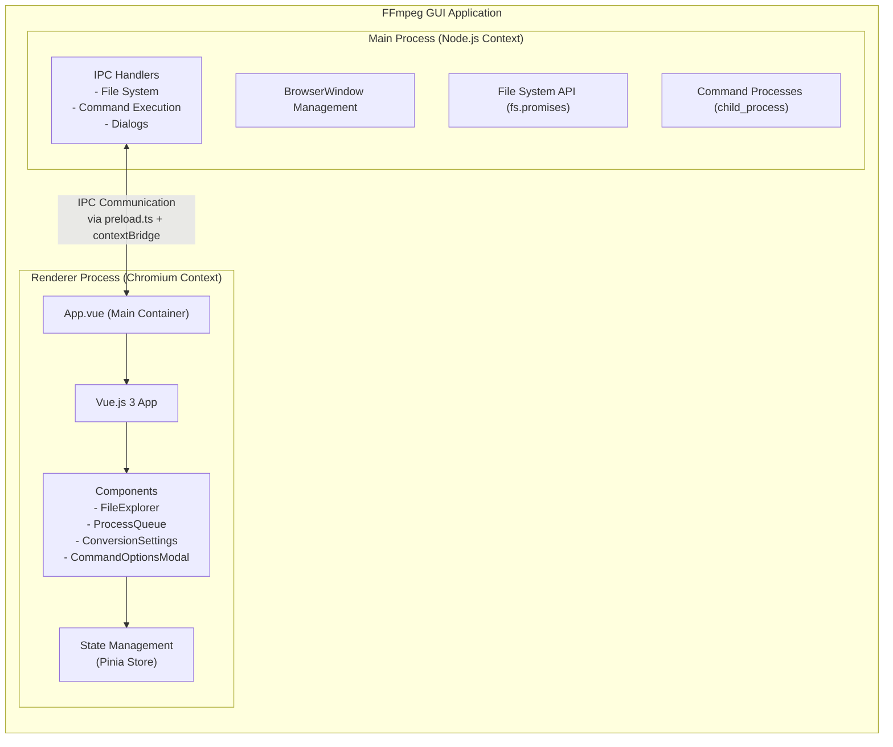
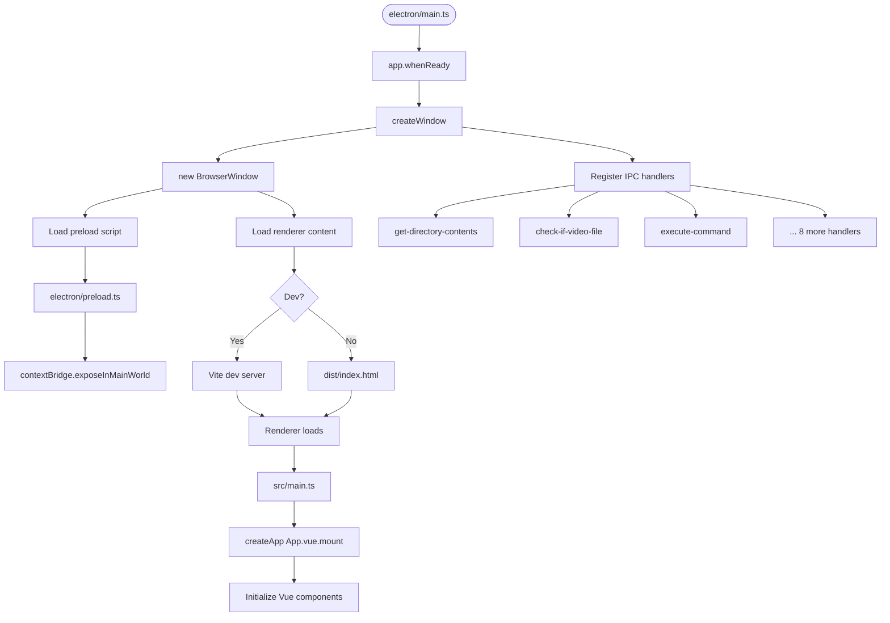
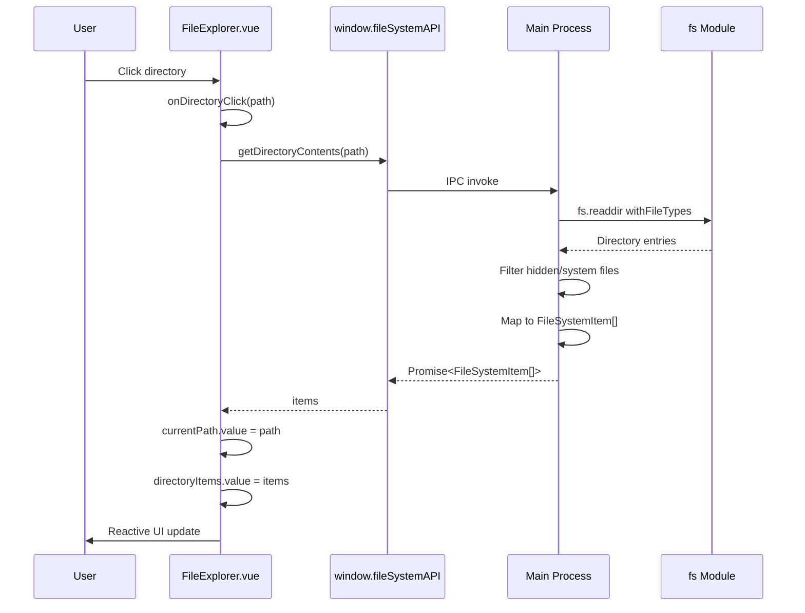
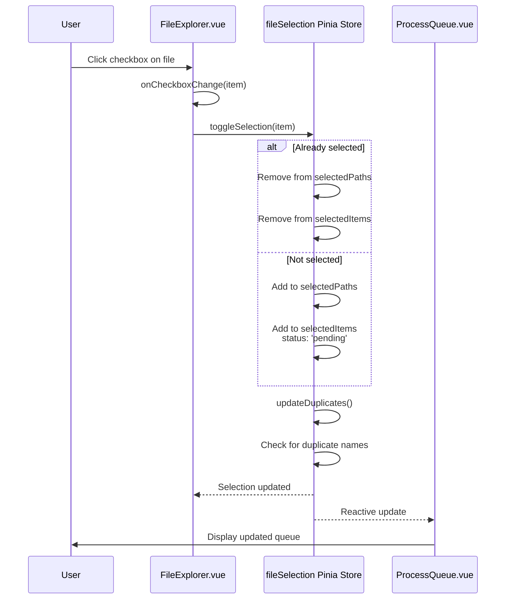
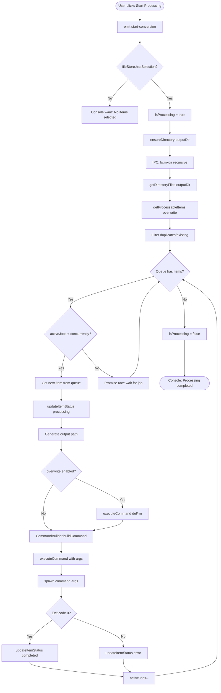
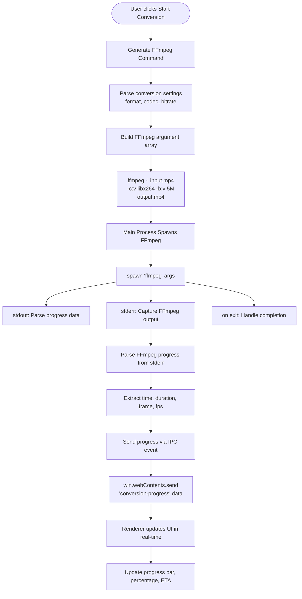
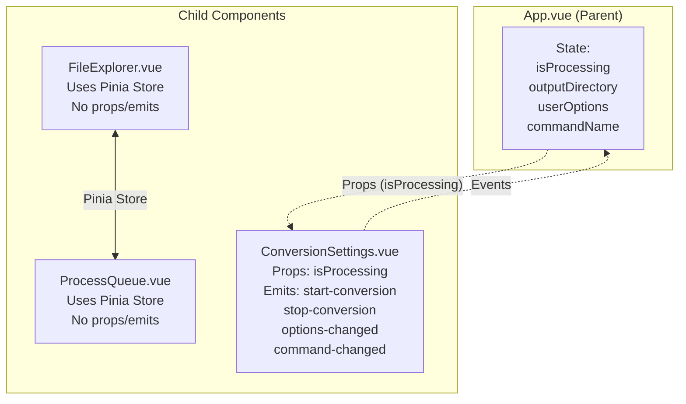
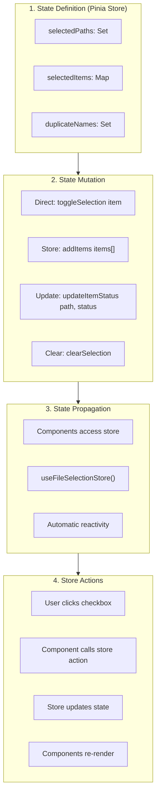
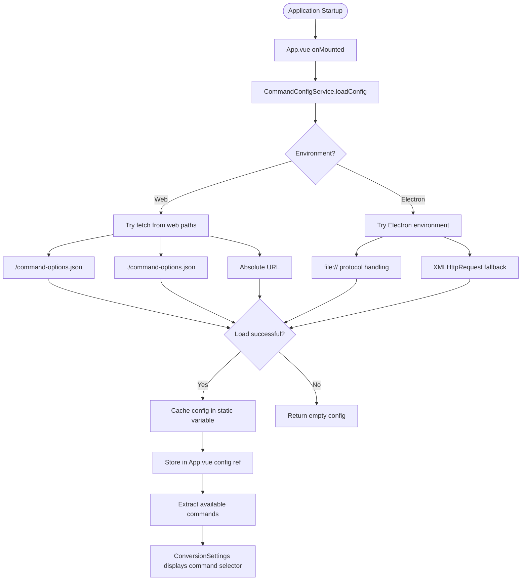
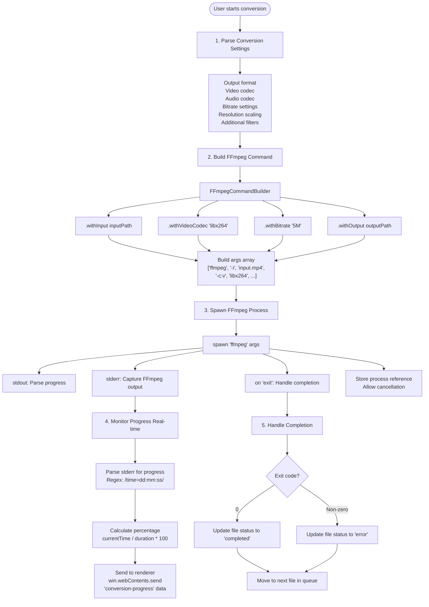

# FFmpeg GUI - Technical Architecture Documentation

**Status**: 🔧 Technical
**Last Updated**: 2025-01-08
**Version**: 0.0.0 (Pre-Alpha)

---

## Table of Contents

1. [Overview](#overview)
2. [Architecture Principles](#architecture-principles)
3. [System Architecture](#system-architecture)
4. [Data Flow](#data-flow)
5. [Component Architecture](#component-architecture)
6. [IPC Communication Layer](#ipc-communication-layer)
7. [State Management](#state-management)
8. [File System Operations](#file-system-operations)
9. [Video Processing Pipeline](#video-processing-pipeline)
10. [Security Model](#security-model)
11. [Error Handling Strategy](#error-handling-strategy)
12. [Performance Considerations](#performance-considerations)
13. [Extension Points](#extension-points)

---

## Overview

### Purpose

This document provides a comprehensive technical overview of the FFmpeg GUI application architecture. It serves as a reference for developers, architects, and contributors who need to understand the system's design, component relationships, and data flow patterns.

### System Summary

FFmpeg GUI is a cross-platform desktop application built with Electron and Vue.js 3 that provides an intuitive interface for command execution, originally designed for video file conversion with FFmpeg but now supporting generic command-line operations. The application follows Electron's multi-process architecture, separating concerns between the main process (Node.js) and renderer process (Vue.js application).

**Key Evolution**: The application has evolved from a FFmpeg-specific video converter to a generic command execution GUI with dynamic configuration support. Commands and their options are loaded from a JSON configuration file, allowing flexible support for various command-line tools.

### Key Technologies

- **Electron v30.0.1**: Cross-platform desktop framework
- **Vue.js 3**: Progressive frontend framework with Composition API
- **TypeScript**: Type-safe JavaScript throughout
- **Vite**: Fast build tool and development server
- **Pinia**: State management for file selection and processing
- **IPC (Inter-Process Communication)**: Secure main-renderer communication
- **Dynamic Command Configuration**: JSON-based command definition system

---

## Architecture Principles

### 1. Separation of Concerns

The application strictly separates responsibilities:
- **Main Process**: System-level operations, file I/O, FFmpeg processes
- **Renderer Process**: UI rendering, user interaction, state management
- **Preload Script**: Secure API bridge with context isolation

### 2. Type Safety

TypeScript is used throughout with strict type checking:
- All components have full type definitions
- IPC interfaces are strongly typed
- No `any` types without explicit justification

### 3. Security First

Security is enforced at architectural boundaries:
- Context isolation prevents renderer access to Node.js APIs
- All system operations go through typed IPC handlers
- File paths are validated before operations
- No direct `eval` or unsafe dynamic code execution

### 4. Reactive UI State

The UI follows Vue.js 3's reactivity model:
- State is managed with `ref()` and `reactive()`
- Props flow down, events flow up
- Components are stateless where possible

### 5. Progressive Enhancement

The application is built incrementally:
- Current implementation uses stub (file copy) for FFmpeg
- Architecture supports real FFmpeg integration
- UI is prepared for progress tracking and error handling

---

## System Architecture

### Multi-Process Model



### Process Responsibilities

#### Main Process ([electron/main.ts](../electron/main.ts))

**Responsibilities:**
- Application lifecycle management (ready, quit, window-all-closed)
- BrowserWindow creation and management
- IPC handler registration and response
- File system operations (read directory, file stats, copy)
- Native dialog management (directory selection)
- FFmpeg process spawning (future)

**Key Operations:**
```typescript
// Directory traversal
get-directory-contents → Promise<FileSystemItem[]>

// File information
check-if-video-file → Promise<boolean>
get-file-stats → Promise<FileStats>

// Path manipulation
get-home-directory → Promise<string>
get-parent-directory → Promise<string>

// File operations
copy-file → Promise<boolean> (stub for ffmpeg)
ensure-directory → Promise<boolean>

// UI interactions
select-directory → Promise<string | null>
```

#### Renderer Process ([src/App.vue](../src/App.vue))

**Responsibilities:**
- UI rendering and layout
- User interaction handling
- State management (video files, processing status)
- Component orchestration
- IPC invocation from renderer

**State Management:**
```typescript
const videoFiles = ref<VideoFile[]>([])      // Video queue
const isProcessing = ref<boolean>(false)     // Processing state
const outputDirectory = ref<string>('')      // Output path
```

#### Preload Script ([electron/preload.ts](../electron/preload.ts))

**Responsibilities:**
- Context bridge setup for secure IPC
- Type-safe API exposure to renderer
- Prevent direct Node.js API access

**Exposed APIs:**
```typescript
window.fileSystemAPI  // File operations
window.ipcRenderer    // Raw IPC access (limited)
```

---

## Data Flow

### 1. Application Initialization Flow



### 2. File Explorer Navigation Flow



### 3. File Selection Flow (Pinia Store)



### 4. Command Execution Flow (Current Implementation)



### 5. Future FFmpeg Integration Flow (Planned)



---

## Component Architecture

### Component Tree

```
App.vue (Root)
│
├─┬─ FileExplorer.vue
│ │
│ ├─► State:
│ │   - currentPath: string
│ │   - directoryItems: FileSystemItem[]
│ │   - navigationHistory: string[]
│ │
│ ├─► Props: (none)
│ │
│ ├─► Emits: (none - uses Pinia store)
│ │
│ └─► Responsibilities:
│     - Directory navigation (up, home, click)
│     - File system display
│     - File/directory selection via checkboxes
│     - Multi-selection support
│     - Integration with fileSelection store
│
├─┬─ ProcessQueue.vue
│ │
│ ├─► State: (none - pure presentation + Pinia store)
│ │
│ ├─► Props: (none - uses fileSelection store)
│ │
│ ├─► Emits: (none - uses Pinia store)
│ │
│ └─► Responsibilities:
│     - Display selected files and directories
│     - Show file status with icons (pending, processing, completed, error, existing)
│     - Display duplicate file warnings
│     - Remove individual items
│     - Clear completed/all items
│     - Show processing statistics
│
├─┬─ ConversionSettings.vue
│ │
│ ├─► State:
│ │   - outputDirectory: string
│ │   - outputDirectoryValid: boolean
│ │   - selectedCommand: string
│ │   - concurrency: number
│ │   - overwrite: boolean
│ │   - showOptionsModal: boolean
│ │
│ ├─► Props:
│ │   - isProcessing: boolean
│ │
│ ├─► Emits:
│ │   - start-conversion: (outputDir: string) => void
│ │   - stop-conversion: () => void
│ │   - output-directory-changed: (dir: string) => void
│ │   - options-changed: (options: UserCommandOptions) => void
│ │   - command-changed: (command: string) => void
│ │   - concurrency-changed: (value: number) => void
│ │   - overwrite-changed: (value: boolean) => void
│ │
│ └─► Responsibilities:
│     - Output directory selection
│     - Command selection from config
│     - Options configuration button
│     - Concurrency control (1-4 parallel jobs)
│     - Overwrite toggle
│     - Start/Stop processing buttons
│     - Display selection count
│
├─┬─ CommandOptionsModal.vue
│ │
│ ├─► State:
│ │   - activeCategory: string
│ │   - localOptions: UserCommandOptions
│ │   - closeOnOverlayClick: boolean
│ │
│ ├─► Props:
│ │   - isOpen: boolean
│ │   - commandConfig: CommandConfig
│ │   - commandName: string
│ │   - config: CommandsConfig
│ │   - modelValue: UserCommandOptions
│ │
│ ├─► Emits:
│ │   - update:isOpen: (value: boolean) => void
│ │   - update:modelValue: (value: UserCommandOptions) => void
│ │
│ └─► Responsibilities:
│     - Display command options in categorized tabs
│     - Show option descriptions and help
│     - Provide option inputs (text, boolean, select)
│     - Display command preview
│     - Reset to defaults
│     - Save/cancel options
│
└─┬─ Options Components (src/components/options/)
    │
    ├─┬─ TextOption.vue
    │ │
    │ ├─► Props: option, modelValue
    │ ├─► Emits: update:modelValue
    │ └─► Responsibilities: Text/number input with validation
    │
    ├─┬─ BooleanOption.vue
    │ │
    │ ├─► Props: option, modelValue
    │ ├─► Emits: update:modelValue
    │ └─► Responsibilities: Toggle switch for boolean flags
    │
    ├─┬─ SelectOption.vue
    │ │
    │ ├─► Props: option, modelValue
    │ ├─► Emits: update:modelValue
    │ └─► Responsibilities: Dropdown selection for predefined options
    │
    └─┬─ OptionHelp.vue
        │
        ├─► Props: option
        ├─► Emits: (none)
        └─► Responsibilities: Display option specification and help tooltip
```

### Component Communication Pattern

**Props Down, Events Up:**



### Component Lifecycle

```typescript
// Each component follows Vue 3 Composition API lifecycle

onMounted(() => {
  // Component is mounted to DOM
  // Initialize default state
  // Set up initial directory for FileExplorer
})

onUpdated(() => {
  // Component has re-rendered due to reactive state change
})

onUnmounted(() => {
  // Clean up before component destruction
  // Remove event listeners, clear timers
})
```

---

## IPC Communication Layer

### IPC Handler Registration

All IPC handlers are registered in the main process during `app.whenReady()`:

```typescript
// electron/main.ts (lines 75-176)

ipcMain.handle('channel-name', async (event, ...args) => {
  // Handler implementation
  return result
})
```

### IPC Channels Reference

| Channel Name | Direction | Purpose | Return Type |
|-------------|-----------|---------|-------------|
| `get-directory-contents` | Renderer → Main | List directory contents | `Promise<FileSystemItem[]>` |
| `get-home-directory` | Renderer → Main | Get user home directory | `Promise<string>` |
| `list-drives` | Renderer → Main | List available drives (Windows) | `Promise<FileSystemItem[]>` |
| `get-parent-directory` | Renderer → Main | Get parent directory path | `Promise<string>` |
| `check-if-video-file` | Renderer → Main | Check if file is video | `Promise<boolean>` |
| `get-file-stats` | Renderer → Main | Get file metadata | `Promise<FileStats \| null>` |
| `select-directory` | Renderer → Main | Open directory dialog | `Promise<string \| null>` |
| `execute-command` | Renderer → Main | Execute any command with args | `Promise<boolean>` |
| `ensure-directory` | Renderer → Main | Create directory if needed | `Promise<boolean>` |
| `get-directory-files` | Renderer → Main | Get file names in directory | `Promise<string[]>` |
| `main-process-message` | Main → Renderer | Main process ready event | `void` (event) |

### Type Safety in IPC

**Preload Script Types:**
```typescript
// electron/preload.ts

contextBridge.exposeInMainWorld('fileSystemAPI', {
  getDirectoryContents: (dirPath: string): Promise<FileSystemItem[]> =>
    ipcRenderer.invoke('get-directory-contents', dirPath),
  // ... all methods are typed
})
```

**Global Window Interface:**
```typescript
// src/types/electron.d.ts (lines 26-45)

declare global {
  interface Window {
    fileSystemAPI: {
      getDirectoryContents(dirPath: string): Promise<FileSystemItem[]>
      // ... all methods typed
    }
  }
}
```

### IPC Error Handling

```typescript
// Main Process Pattern
ipcMain.handle('operation-name', async (_event, arg) => {
  try {
    const result = await someOperation(arg)
    return { success: true, data: result }
  } catch (error) {
    console.error('Operation failed:', error)
    return { success: false, error: (error as Error).message }
  }
})

// Renderer Process Pattern
const response = await window.fileSystemAPI.someOperation(arg)
if (!response.success) {
  // Handle error
  console.error(response.error)
}
```

---

## State Management

### Pinia Store Architecture

The application uses **Pinia** for centralized state management. The primary store is [fileSelection.ts](../src/stores/fileSelection.ts).

### File Selection Store ([stores/fileSelection.ts](../src/stores/fileSelection.ts))

**State:**
```typescript
selectedPaths: Set<string>                    // Set of selected item paths
selectedItems: Map<string, SelectedItem>      // Full item data map
duplicateNames: Set<string>                  // Track duplicate filenames
```

**Computed Getters:**
```typescript
selectedList: SelectedItem[]                  // Array of selected items
selectedCount: number                         // Count of selected items
hasSelection: boolean                         // Whether any items are selected
```

**Actions:**
```typescript
toggleSelection(item: FileSystemItem)         // Toggle item selection
isSelected(path: string): boolean             // Check if path is selected
addItems(items: FileSystemItem[])             // Add multiple items
removeItem(path: string)                      // Remove single item
clearSelection()                              // Clear all selections
clearCompleted()                              // Clear completed/error items
updateItemStatus(path, status)                // Update processing status
getItemStatus(path): Status | null            // Get item status
updateDuplicates()                            // Update duplicate detection
getProcessableItems(overwrite, outputFiles)   // Get items to process
```

**Duplicate Detection:**
- Automatically detects files with duplicate names
- Marks duplicates with `isDuplicate: true`
- When overwrite is disabled, duplicates are marked as 'existing' status
- When overwrite is enabled, all duplicates can be processed

### Application State ([App.vue](../src/App.vue))

Local component state:
```typescript
const isProcessing = ref<boolean>(false)          // Processing state
const outputDirectory = ref<string>('')           // Output path
const userOptions = ref<UserCommandOptions>({})   // Command options
const config = ref<CommandsConfig | null>(null)   // Loaded config
const commandName = ref<string>('cp')             // Selected command
const concurrency = ref<number>(1)                // Parallel job count
const overwrite = ref<boolean>(false)             // Overwrite flag
const activeJobs = ref<number>(0)                 // Active job counter
```

### State Flow Pattern



### Reactive State Strategy

**Using `ref()` for Primitives:**
```typescript
const isProcessing = ref<boolean>(false)
// Access: isProcessing.value
```

**Using `ref()` for Arrays:**
```typescript
const videoFiles = ref<VideoFile[]>([])
// Access: videoFiles.value
// Modify: videoFiles.value.push(...)
```

**Reactive Object Updates:**
```typescript
// Object properties are reactive automatically
file.status = 'processing'  // Triggers UI update
```

### Computed State (Planned)

Future enhancements may use Vue's `computed()` for derived state:

```typescript
const pendingCount = computed(() =>
  videoFiles.value.filter(f => f.status === 'pending').length
)

const completedCount = computed(() =>
  videoFiles.value.filter(f => f.status === 'completed').length
)

const progressPercentage = computed(() => {
  const total = videoFiles.value.length
  const completed = completedCount.value
  return total > 0 ? (completed / total) * 100 : 0
})
```

---

## File System Operations

### Supported File System Operations

The application abstracts file system operations through typed APIs:

| Operation | Method | Platform | Error Handling |
|-----------|--------|----------|----------------|
| List directory | `fs.readdir()` | All | Try-catch with error throw |
| Get file stats | `fs.stat()` | All | Returns null on error |
| Copy file | `exec('cp')` | Unix-like | Returns boolean |
| Create directory | `fs.mkdir()` | All | Recursive flag |

### Video File Detection

```typescript
// electron/main.ts (lines 114-122)

const videoExtensions = [
  '.mp4', '.avi', '.mkv', '.mov', '.wmv', '.flv', '.webm',
  '.m4v', '.3gp', '.ogv', '.ts', '.mts', '.m2ts', '.vob',
  '.mpg', '.mpeg', '.divx', '.xvid', '.rm', '.rmvb', '.asf'
]

ipcMain.handle('check-if-video-file', (_event, filePath) => {
  const ext = path.extname(filePath).toLowerCase()
  return videoExtensions.includes(ext)
})
```

### File Path Handling

**Cross-Platform Path Separators:**
```typescript
// Use path module for cross-platform compatibility
path.join(dirPath, itemName)      // Join path segments
path.dirname(filePath)            // Get parent directory
path.extname(filePath)            // Get file extension
```

**Path Validation (Planned):**
```typescript
// Future: Add path validation
function validatePath(userPath: string): boolean {
  const resolved = path.resolve(userPath)
  // Check for directory traversal
  // Check for invalid characters
  // Verify path exists
  return true
}
```

### Directory Navigation Strategy

```typescript
// Navigation state in FileExplorer.vue

const currentPath = ref<string>(await getHomeDirectory())
const navigationHistory = ref<string[]>([])

// Navigate to directory
const navigateToDirectory = async (dirPath: string) => {
  navigationHistory.value.push(currentPath.value)
  currentPath.value = dirPath
  await loadDirectoryContents(dirPath)
}

// Navigate to parent
const navigateUp = async () => {
  const parentPath = await window.fileSystemAPI.getParentDirectory(currentPath.value)
  if (parentPath !== currentPath.value) {
    navigateToDirectory(parentPath)
  }
}

// Navigate to home
const navigateHome = async () => {
  navigationHistory.value = []
  const homePath = await window.fileSystemAPI.getHomeDirectory()
  navigateToDirectory(homePath)
}
```

---

## Command Configuration System

### Dynamic Command Loading

The application uses a JSON-based configuration system to define commands and their options dynamically. This allows the UI to adapt to different command-line tools without code changes.

### Configuration File ([public/command-options.json](../public/command-options.json))

**Structure:**
```typescript
interface CommandsConfig {
  commands: {
    [commandName: string]: CommandConfig
  }
}

interface CommandConfig {
  name: string
  description: string
  categories: {
    [categoryName: string]: OptionCategory
  }
}

interface OptionCategory {
  name: string
  description: string
  options: {
    [optionKey: string]: CommandOption
  }
}

interface CommandOption {
  name: string
  description: string
  type: 'text' | 'number' | 'boolean' | 'select' | 'multi-select'
  flag: string
  default?: string | number | boolean
  options?: string[]  // for select types
  placeholder?: string
  validation?: string  // regex pattern
  required?: boolean
  specification: string
}
```

### Command Config Service ([services/commandConfig.ts](../src/services/commandConfig.ts))

**Responsibilities:**
- Load configuration from JSON file
- Handle Electron and web environment differences
- Validate option values
- Generate command flags from user options

**Key Methods:**
```typescript
loadConfig(): Promise<CommandsConfig>
validateOption(option: CommandOption, value: any): boolean
generateCommandFlags(userOptions, command, config): string[]
getCommandConfig(command: string, config): CommandConfig
```

### Command Builder ([services/commandBuilder.ts](../src/services/commandBuilder.ts))

**Responsibilities:**
- Build complete command with all flags
- Generate command preview for UI
- Apply user options to command template

**Key Methods:**
```typescript
buildCommand(commandName, inputPath, outputPath, userOptions, config): {command, args}
buildPreviewCommand(commandName, userOptions, config): string
```

### Configuration Loading Flow



### Option Type Handling

**Text/Number Options:**
- Input field with placeholder
- Optional regex validation
- Required field checking
- Default value support

**Boolean Options:**
- Toggle switch UI
- Only adds flag when true
- Default to false if unspecified

**Select Options:**
- Dropdown with predefined choices
- Supports "none" option to exclude
- Default value selection

**Multi-Select Options:**
- Multiple value selection
- Flag repeated for each value
- Array of values

### Command Preview

The system provides real-time command preview before execution:

```
Command: ffmpeg
Input: video.mp4
Output: video_converted.mp4
Options: codec=libx264, bitrate=5M

Generated Preview:
ffmpeg -i video.mp4 -c:v libx264 -b:v 5M video_converted.mp4
```

---

## Video Processing Pipeline

### Current Implementation

The application currently supports generic command execution through a flexible IPC handler:

```typescript
// electron/main.ts (lines 209-291)

ipcMain.handle('execute-command', async (_event, command, args) => {
  // Platform-specific command handling
  let actualCommand = command
  let actualArgs = [...args]

  // Windows: convert Unix commands to Windows equivalents
  if (process.platform === 'win32') {
    if (command === 'cp') {
      actualCommand = 'copy'
      // Adjust args for copy command syntax
    }
    // Quote paths with spaces
    actualArgs = actualArgs.map(arg =>
      arg.includes(' ') ? `"${arg.replace(/\//g, '\\')}"` : arg.replace(/\//g, '\\')
    )
  }

  // Spawn process with platform-appropriate settings
  const childProcess = spawn(actualCommand, actualArgs, {
    stdio: ['pipe', 'pipe', 'pipe'],
    shell: process.platform === 'win32'
  })

  // Capture stdout/stderr for logging
  // Return promise that resolves on exit code 0
})
```

**Features:**
- Cross-platform command execution (Windows/Unix)
- Automatic path quoting for spaces
- Platform-specific command translation (e.g., cp → copy)
- Stdout/stderr logging
- Exit code handling
- Support for any command-line tool

### Future FFmpeg Integration Architecture

**Planned Components:**

1. **FFmpeg Service Module** (New)
   ```typescript
   // electron/services/ffmpeg.ts
   export class FFmpegService {
     async convert(config: ConversionConfig): Promise<ConversionResult>
     spawnProcess(input: string, output: string, args: string[]): ChildProcess
     parseProgress(stderr: string): ProgressData
   }
   ```

2. **Progress Tracking System** (New)
   ```typescript
   // electron/handlers/progress.ts
   interface ProgressData {
     currentTime: number      // Current timestamp in video
     duration: number         // Total video duration
     percentage: number       // 0-100
     fps: number              // Current processing speed
     bitrate: number          // Current bitrate
   }

   // Send progress to renderer
   win.webContents.send('conversion-progress', progressData)
   ```

3. **Command Builder** (New)
   ```typescript
   // electron/utils/ffmpeg-command-builder.ts
   export class FFmpegCommandBuilder {
     withInput(path: string): this
     withVideoCodec(codec: string): this
     withAudioCodec(codec: string): this
     withBitrate(bitrate: string): this
     withResolution(width: number, height: number): this
     withOutput(path: string): this
     build(): string[]
   }
   ```

### Conversion Workflow (Future)



### Error Handling in Conversion

```typescript
// Future error handling pattern

try {
  await convertFile(inputPath, outputPath, settings)
  file.status = 'completed'
} catch (error) {
  file.status = 'error'
  file.error = (error as Error).message

  // Categorize errors
  if (error.message.includes('Permission denied')) {
    showError('Cannot write to output directory. Check permissions.')
  } else if (error.message.includes('Invalid data')) {
    showError('Input file is corrupted or not a valid video file.')
  } else {
    showError('An unexpected error occurred during conversion.')
  }
}
```

---

## Security Model

### Context Isolation

Electron's context isolation is enabled by default, preventing the renderer process from accessing Node.js APIs directly:

```typescript
// electron/main.ts (lines 35-37)

webPreferences: {
  preload: path.join(__dirname, 'preload.mjs'),
  // contextIsolation: true (enabled by default)
}
```

### Secure IPC Bridge

The preload script creates a secure bridge using `contextBridge`:

```typescript
// electron/preload.ts (lines 23-35)

contextBridge.exposeInMainWorld('fileSystemAPI', {
  getDirectoryContents: (dirPath: string): Promise<FileSystemItem[]> =>
    ipcRenderer.invoke('get-directory-contents', dirPath),
  // All methods are explicitly exposed and typed
})
```

**Security Benefits:**
- Renderer cannot access Node.js APIs directly
- Only explicitly exposed methods are available
- TypeScript types prevent API misuse
- No arbitrary code execution from renderer

### Input Validation

**File Path Validation (Needs Enhancement):**
```typescript
// Current: Basic validation
ipcMain.handle('get-directory-contents', async (_event, dirPath) => {
  // No validation currently performed
  const items = await fs.readdir(dirPath, { withFileTypes: true })
  return result
})

// Recommended: Add validation
ipcMain.handle('get-directory-contents', async (_event, dirPath) => {
  // Validate path
  const normalized = path.normalize(dirPath)
  if (!normalized.startsWith('/home') && !normalized.startsWith('C:\\')) {
    throw new Error('Access denied: Invalid path')
  }

  // Check for directory traversal
  if (normalized.includes('..')) {
    throw new Error('Access denied: Directory traversal not allowed')
  }

  const items = await fs.readdir(normalized, { withFileTypes: true })
  return result
})
```

**FFmpeg Command Sanitization (Planned):**
```typescript
// Prevent command injection
function sanitizeFFmpegArgs(userArgs: string[]): string[] {
  const safeArgs: string[] = []

  for (const arg of userArgs) {
    // Remove shell metacharacters
    const sanitized = arg.replace(/[;&|`$()]/g, '')

    // Validate argument format
    if (sanitized.match(/^[a-zA-Z0-9_\-./]+$/)) {
      safeArgs.push(sanitized)
    }
  }

  return safeArgs
}
```

### File System Access Control

**Current Access Model:**
- Full file system access through IPC
- No user permission prompts
- No access logging

**Recommended Enhancements:**
1. **Scoped File Access**: Request permission for each directory
2. **Access Logging**: Log file system operations
3. **User Prompts**: Confirm before destructive operations
4. **Sandbox Mode**: Restrict access to user-selected directories only

### Security Checklist

- ✅ Context isolation enabled
- ✅ No direct Node.js API access in renderer
- ✅ Typed IPC interface
- ⚠️ File path validation needs enhancement
- ⚠️ No user permission prompts for file access
- ❌ FFmpeg command sanitization not implemented
- ❌ No operation logging
- ❌ No sandbox restrictions

---

## Error Handling Strategy

### Error Categories

1. **File System Errors**
   - File not found
   - Permission denied
   - Directory doesn't exist
   - Disk full

2. **IPC Communication Errors**
   - Handler not registered
   - Invalid arguments
   - Timeout
   - Process crash

3. **Conversion Errors** (Future)
   - FFmpeg not found
   - Invalid input file
   - Unsupported codec
   - Out of memory

4. **User Interface Errors**
   - Invalid user input
   - Missing required settings
   - Operation cancelled

### Error Handling Patterns

**Main Process Pattern:**
```typescript
ipcMain.handle('operation-name', async (_event, arg) => {
  try {
    const result = await performOperation(arg)
    return { success: true, data: result }
  } catch (error) {
    console.error('Operation failed:', error)
    return {
      success: false,
      error: (error as Error).message,
      code: (error as any).code
    }
  }
})
```

**Renderer Process Pattern:**
```typescript
const result = await window.fileSystemAPI.someOperation(arg)

if (!result.success) {
  // Handle error
  switch (result.code) {
    case 'ENOENT':
      showErrorMessage('File not found. Please check the path.')
      break
    case 'EACCES':
      showErrorMessage('Permission denied. Check file permissions.')
      break
    default:
      showErrorMessage(`An error occurred: ${result.error}`)
  }
}
```

**Component Error Boundary (Planned):**
```typescript
// Vue 3 error handler pattern
app.config.errorHandler = (err, instance, info) => {
  console.error('Global error:', err)
  console.error('Component:', instance)
  console.error('Info:', info)

  // Send error to error tracking service
  reportError(err, info)
}
```

### User Error Communication

**Current State:**
- Console logging only
- No user-facing error messages
- No error recovery guidance

**Planned Improvements:**
```typescript
// Error toast notifications
function showErrorToast(message: string, details?: string) {
  toastStore.show({
    type: 'error',
    message,
    details,
    duration: 5000
  })
}

// Error dialog for critical errors
function showErrorDialog(title: string, message: string, error: Error) {
  dialog.showErrorBox(title, `${message}\n\n${error.message}`)
}
```

---

## Performance Considerations

### Current Performance Characteristics

1. **File System Operations**
   - Synchronous readdir calls may block main process
   - No caching of directory listings
   - Repeated stat calls for same files

2. **Video Processing**
   - Stub implementation is fast (simple file copy)
   - No real CPU usage currently
   - Future FFmpeg will be CPU-intensive

3. **UI Responsiveness**
   - 500ms delay between file processing (artificial)
   - Main thread not blocked during file operations
   - Reactive UI updates perform well

### Optimization Strategies

**1. Directory Listing Caching (Planned)**
```typescript
const directoryCache = new Map<string, {
  items: FileSystemItem[]
  timestamp: number
}>()

const CACHE_TTL = 5000 // 5 seconds

ipcMain.handle('get-directory-contents', async (_event, dirPath) => {
  const cached = directoryCache.get(dirPath)
  const now = Date.now()

  if (cached && (now - cached.timestamp) < CACHE_TTL) {
    return cached.items
  }

  const items = await loadDirectoryContents(dirPath)
  directoryCache.set(dirPath, { items, timestamp: now })
  return items
})
```

**2. Debounced File Operations (Planned)**
```typescript
// Debounce rapid user interactions
import { debounce } from 'lodash-es'

const debouncedLoad = debounce(async (path: string) => {
  const items = await window.fileSystemAPI.getDirectoryContents(path)
  directoryItems.value = items
}, 300)
```

**3. Lazy Loading for Large Directories (Planned)**
```typescript
// Load directories in chunks
const CHUNK_SIZE = 100

async function loadDirectoryChunk(path: string, offset: number) {
  const allItems = await fs.readdir(path, { withFileTypes: true })
  return allItems.slice(offset, offset + CHUNK_SIZE)
}
```

**4. FFmpeg Process Pool (Future)**
```typescript
// Limit concurrent FFmpeg processes
const MAX_CONCURRENT_PROCESSES = 2
const activeProcesses: ChildProcess[] = []

async function queueConversion(input: string, output: string) {
  while (activeProcesses.length >= MAX_CONCURRENT_PROCESSES) {
    await Promise.race(activeProcesses.map(p => new Promise(r => p.on('exit', r))))
  }

  const process = spawnFFmpeg(input, output)
  activeProcesses.push(process)

  process.on('exit', () => {
    const index = activeProcesses.indexOf(process)
    activeProcesses.splice(index, 1)
  })
}
```

### Memory Management

**Current Concerns:**
- Large video file lists stored in memory
- No virtualization for long lists
- File stats loaded for all files

**Planned Improvements:**
```typescript
// Virtual scrolling for large lists
import { useVirtualList } from '@vueuse/core'

const { list, containerProps, wrapperProps } = useVirtualList(
  largeFileList,
  { itemHeight: 40, overscan: 10 }
)

// Lazy stat loading
async function getStatsIfNeeded(item: FileSystemItem) {
  if (!item.size && item.isFile) {
    const stats = await window.fileSystemAPI.getFileStats(item.path)
    item.size = stats?.size
  }
}
```

---

## Extension Points

### Adding New IPC Handlers

**Step 1: Define Handler in Main Process**
```typescript
// electron/main.ts
ipcMain.handle('new-operation', async (_event, arg1, arg2) => {
  try {
    const result = await performNewOperation(arg1, arg2)
    return { success: true, data: result }
  } catch (error) {
    return { success: false, error: (error as Error).message }
  }
})
```

**Step 2: Expose in Preload Script**
```typescript
// electron/preload.ts
contextBridge.exposeInMainWorld('fileSystemAPI', {
  // Existing methods...
  newOperation: (arg1: string, arg2: number): Promise<Result> =>
    ipcRenderer.invoke('new-operation', arg1, arg2)
})
```

**Step 3: Add TypeScript Types**
```typescript
// src/types/electron.d.ts
declare global {
  interface Window {
    fileSystemAPI: {
      // Existing methods...
      newOperation(arg1: string, arg2: number): Promise<Result>
    }
  }
}
```

**Step 4: Use in Component**
```typescript
// In any Vue component
const result = await window.fileSystemAPI.newOperation('test', 42)
```

### Adding New Vue Components

**Component Template:**
```vue
<template>
  <div class="my-component">
    <h2>{{ title }}</h2>
    <slot></slot>
  </div>
</template>

<script setup lang="ts">
import { ref } from 'vue'

interface Props {
  title: string
  initialValue?: number
}

const props = withDefaults(defineProps<Props>(), {
  initialValue: 0
})

const emit = defineEmits<{
  update: [value: number]
  change: [event: Event]
}>()

const localValue = ref(props.initialValue)
</script>

<style scoped>
.my-component {
  /* Component styles */
}
</style>
```

### Adding Conversion Presets (Future)

```typescript
// electron/presets/conversion-presets.ts
export interface ConversionPreset {
  name: string
  description: string
  outputFormat: string
  videoCodec: string
  audioCodec: string
  bitrate: string
  extensions: string[]
}

export const PRESETS: ConversionPreset[] = [
  {
    name: 'High Quality MP4',
    description: 'H.264 video with AAC audio, 5 Mbps bitrate',
    outputFormat: 'mp4',
    videoCodec: 'libx264',
    audioCodec: 'aac',
    bitrate: '5M',
    extensions: ['mp4', 'mov', 'avi']
  },
  {
    name: 'Web Optimized',
    description: 'H.264 video optimized for web streaming',
    outputFormat: 'mp4',
    videoCodec: 'libx264',
    audioCodec: 'aac',
    bitrate: '2M',
    extensions: ['mp4']
  }
  // ... more presets
]
```

### Adding FFmpeg Filters (Future)

```typescript
// electron/filters/video-filters.ts
export interface VideoFilter {
  name: string
  description: string
  buildFFmpegArgs: (params: any) => string[]
}

export const SCALE_FILTER: VideoFilter = {
  name: 'Scale',
  description: 'Resize video to specified dimensions',
  buildFFmpegArgs: (params) => {
    return ['-vf', `scale=${params.width}:${params.height}`]
  }
}

export const CROP_FILTER: VideoFilter = {
  name: 'Crop',
  description: 'Crop video to specified area',
  buildFFmpegArgs: (params) => {
    return ['-vf', `crop=${params.width}:${params.height}:${params.x}:${params.y}`]
  }
}
```

---

## Appendices

### A. TypeScript Type Definitions

**Core Types** ([src/types/electron.d.ts](../src/types/electron.d.ts))

```typescript
// File system item representation
export interface FileSystemItem {
  name: string
  path: string
  isDirectory: boolean
  isFile: boolean
}

// Video file in processing queue
export interface VideoFile {
  name: string
  path: string
  size?: number
  status: 'pending' | 'processing' | 'completed' | 'error'
}

// Conversion configuration
export interface ConversionConfig {
  outputDirectory: string
  outputFormat?: string
  videoCodec?: string
  audioCodec?: string
  bitrate?: string
  resolution?: { width: number; height: number }
}

// File metadata
export interface FileStats {
  size: number
  modified: Date
  isDirectory: boolean
  isFile: boolean
}
```

### B. File Organization

```
ffmpeg-gui/
├── electron/                         # Main process code
│   ├── main.ts                      # Entry point, IPC handlers
│   ├── preload.ts                   # Preload script (API bridge)
│   └── electron-env.d.ts            # Electron TypeScript definitions
│
├── src/                              # Renderer process code
│   ├── components/                   # Vue components
│   │   ├── FileExplorer.vue          # File browser with navigation
│   │   ├── ProcessQueue.vue          # Processing queue display
│   │   ├── ConversionSettings.vue    # Output and command configuration
│   │   ├── CommandOptionsModal.vue   # Command options editor
│   │   ├── HelloWorld.vue            # Example component
│   │   ├── VideoQueue.vue            # Legacy queue component (deprecated)
│   │   └── options/                  # Option input components
│   │       ├── TextOption.vue        # Text/number input
│   │       ├── BooleanOption.vue     # Boolean toggle
│   │       ├── SelectOption.vue      # Dropdown select
│   │       └── OptionHelp.vue        # Help tooltip
│   ├── services/                     # Business logic services
│   │   ├── commandBuilder.ts         # Command building logic
│   │   └── commandConfig.ts          # Config loading and validation
│   ├── stores/                       # Pinia stores
│   │   └── fileSelection.ts          # File selection state management
│   ├── types/                        # TypeScript definitions
│   │   ├── electron.d.ts             # Electron API types
│   │   ├── command-options.ts        # Command config types
│   │   └── vite-env.d.ts             # Vite environment types
│   ├── App.vue                       # Root component
│   └── main.ts                       # Vue app initialization
│
├── public/                           # Public assets
│   └── command-options.json          # Command configuration
│
├── docs/                             # Documentation
│   ├── AGENTS.md                     # Documentation hub
│   ├── architecture.md               # This document
│   ├── audit_plan.md          # Security audit plan
│   └── ffmpeg_options_ui_implementation_plan.md  # UI plans
│
├── dist/                       # Built renderer assets
├── dist-electron/              # Built main process assets
└── electron-builder.json5      # Packaging configuration
```

### C. Development Commands

```bash
# Install dependencies
npm install

# Development mode with hot reload
npm run dev

# Build for production (web assets only)
npm run build

# Build Electron app (unpacked)
npm run build:electron

# Package application (creates installer)
npm run dist

# Run packaged electron app
npm run electron
```

### D. Related Documentation

- [AGENTS.md](./AGENTS.md) - Documentation hub and getting started
- [audit_plan.md](./audit_plan.md) - Security and code quality guidelines
- [ffmpeg_options_ui_implementation_plan.md](./ffmpeg_options_ui_implementation_plan.md) - UI implementation plans

### E. Architecture Decision Records

**ADR-001: Electron Multi-Process Architecture**
- **Status**: Accepted
- **Context**: Need cross-platform desktop app with web technologies
- **Decision**: Use Electron with strict main/renderer separation
- **Consequences**: Secure but requires IPC communication overhead

**ADR-002: Vue.js 3 Composition API**
- **Status**: Accepted
- **Context**: Modern reactive framework for UI
- **Decision**: Use Vue 3 with Composition API and TypeScript
- **Consequences**: Better type safety, but learning curve for Options API developers

**ADR-003: Stub FFmpeg Implementation**
- **Status**: Temporary
- **Context**: UI development needed before FFmpeg integration
- **Decision**: Use file copy as stub placeholder
- **Consequences**: Faster development, but requires refactoring later

**ADR-004: TypeScript Strict Mode**
- **Status**: Accepted
- **Context**: Type safety for IPC and component communication
- **Decision**: Enable strict TypeScript throughout
- **Consequences**: Fewer runtime errors, but more verbose code

---

## Document Metadata

**Author**: FFmpeg GUI Development Team
**Status**: Active - Technical Reference
**Version**: 1.1.0
**Last Modified**: 2025-01-08
**Review Cycle**: Quarterly

**Version History:**
- 1.1.0 (2025-01-08): Updated for Pinia state management, command configuration system, and generic command execution
- 1.0.0 (2025-12-27): Initial architecture documentation

---

**End of Architecture Document**
